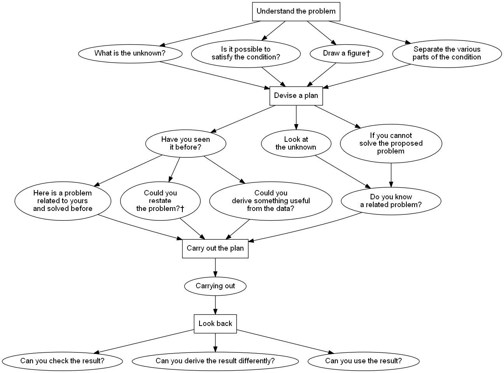

# Short Dictionary of Heuristic

> **Inspired by:** George Polya (20141026) **How to Solve It: A New Aspect of Mathematical Method** (Princeton Science Library). [Kindle Edition](https://www.amazon.com/How-Solve-Aspect-Mathematical-Method-ebook/dp/B0073X0IOA/).

[**Modern heuristic**](ModernHeuristic.md) seeks to understand problem-solving by analyzing *mental operations* that aid the process. It integrates logical and psychological insights, drawing from historical thinkers like [Pappus](Pappus.md), [Descartes](Descartes.md), [Leibniz](Leibnitz.md), and [Bolzano](Bolzano.md) while emphasizing direct problem-solving experience. A comprehensive study should identify universal strategies across diverse problems, focusing on general principles rather than domain-specific details. Ultimately, its practical aim is to enhance the teaching of mathematics and **improve problem-solving efficiency**.

Representing Pólya’s heuristics in  **Turtle format** ([pol14.ttl](pol14.ttl)) provides a **structured, interoperable, and queryable way** to present these heuristics. This representation is useful for **knowledge graph-driven problem-solving**, AI integration, and education.

## How To Solve It Heuristic
### Understanding the Problem 
> Identify what is given, what is unknown, and the conditions.

[What is the unknown](WhatIsTheUnknown.md)? What are the data? What is the [condition](Condition.md)? [Is it possible to satisfy the condition](IsItPossibleToSatisfyTheCondition.md)? Is the condition sufficient to determine the unknown? Or is it insufficient? Or [redundant](Redundant.md)? Or [contradictory](Contradictory.md)? [Draw a figure.](DrawAFigure.md) Introduce suitable [notation](Notation.md). [Separate the various parts of the condition](SeparateTheVariousPartsOfTheCondition.md). Can you write them down?

### Devising a Plan 
> Think of possible strategies (e.g., working backward, drawing diagrams, using analogies).

[Have you seen it before](HaveYouSeenItBefore.md)? Or have you seen the same problem in a slightly different form? [Do you know a related problem](DoYouKnowARelatedProblem.md)? Do you know a theorem that could be useful? [Look at the unknown](LookAtTheUnknown.md)! And try to think of a familiar problem having the same or a similar unknown. [Here is a problem related to yours and solved before](HereIsAProblemRelatedToYoursAndSolvedBefore.md). Could you use it? Could you use its result? Could you use its method? Should you introduce some [auxiliary element](AuxiliaryElements.md) in order to make its use possible? [Could you restate the problem](CouldYouRestateTheProblem.md)? Could you restate it still differently? Go back to [definitions](Definition.md). 

[If you cannot solve the proposed problem](IfYouCannotSolveTheProposedProblem.md) try to solve first some related problem. Could you imagine a more accessible related problem? A more [general problem](Generalization.md)? A more [special problem](Specialization.md)? An [analogous problem](Analogy.md)? Could you solve a part of the problem? Keep only a part of the condition, drop the other part; how far is the unknown then determined, how can it vary? [Could you derive something useful from the data](CouldYouDeriveSomethingUsefulFromTheData.md)? Could you think of other data appropriate to determine the unknown? Could you change the unknown or the data, or both if necessary, so that the new unknown and the new data are nearer to each other? [Did you use all the data](DidYouUseAllTheData.md)? Did you use the whole condition? Have you taken into account all essential notions involved in the problem?

### Carrying Out the Plan 
> Execute the chosen method carefully.

[Carrying out](CarryingOut.md) your plan of the solution, check each step. Can you see clearly that the step is correct? Can you prove that it is correct?

### Looking Back 
> Reflect on the solution, check results, and consider alternative approaches.

[Can you check the result](CanYouCheckTheResult.md)? Can you check the argument? [Can you derive the result differently](CanYouDeriveTheResultDifferently.md)? Can you see it at a glance? [Can you use the result](CanYouUseTheResult.md), or the method, for some other problem?

## Heuristic A to Z
- [Analogy](Analogy.md) : A method of reasoning by comparing the given problem to a similar known problem.
- [Auxiliary elements](AuxiliaryElements.md) : Additional constructions that simplify or clarify the problem.
- [Auxiliary problem](AuxiliaryProblem.md) : A secondary problem introduced to help solve the original problem.
- [Bolzano](Bolzano.md) : A reference to the contributions of Bernard Bolzano to problem-solving and mathematical logic.
- [Bright idea](BrightIdea.md) : An unexpected insight or intuition that advances problem-solving.
- [Can you check the result?](CanYouCheckTheResult.md) : A call to verify the solution’s correctness by reconsidering the process.
- [Can you derive the result differently?](CanYouDeriveTheResultDifferently.md) : A suggestion to confirm a result by finding an alternative approach.
- [Can you use the result?](CanYouUseTheResult.md) : Encouragement to apply a derived result to a new or related problem.
- [Carrying out](CarryingOut.md) : The stage of executing the problem-solving plan systematically.
- [Condition](Condition.md) : The set of restrictions and assumptions defining the problem.
- [Contradictory†](Contradictory.md) : No description available.
- [Corollary](Corollary.md) : A direct consequence or extension of a previously established result.
- [Could you derive something useful from the data?](CouldYouDeriveSomethingUsefulFromTheData.md) : Encourages extracting meaningful insights from given information.
- [Could you restate the problem?†](CouldYouRestateTheProblem.md) : No description available.
- [Decomposing and recombining](DecomposingAndRecombining.md) : Breaking a problem into smaller parts and reassembling them for a solution.
- [Definition](Definition.md) : A precise statement of the meaning of terms used in problem-solving.
- [Descartes](Descartes.md) : A nod to René Descartes and his structured approach to mathematical reasoning.
- [Determination, hope, success](DeterminationHopeSuccess.md) : The mindset necessary for effective problem-solving.
- [Diagnosis](Diagnosis.md) : Examining a problem deeply to identify its key difficulties.
- [Did you use all the data?](DidYouUseAllTheData.md) : A reminder to consider all given information in problem-solving.
- [Do you know a related problem?](DoYouKnowARelatedProblem.md) : Encourages recalling similar problems that may offer a solution path.
- [Draw a figure†](DrawAFigure.md) : No description available.
- [Examine your guess](ExamineYourGuess.md) : A step in verifying the plausibility of a conjectured solution.
- [Figures](Figures.md) : The role of diagrams and visual representations in mathematical thinking.
- [Generalization](Generalization.md) : Extending a specific result to a broader context.
- [Have you seen it before?](HaveYouSeenItBefore.md) : Encourages pattern recognition and recalling past problem-solving experiences.
- [Here is a problem related to yours and solved before](HereIsAProblemRelatedToYoursAndSolvedBefore.md) : A reminder to draw insights from similar solved problems.
- [Heuristic](Heuristic.md) : The study and use of strategies that aid in problem-solving.
- [Heuristic reasoning](HeuristicReasoning.md) : A method of thinking that relies on intuition and experience rather than strict logic.
- [If you cannot solve the proposed problem](IfYouCannotSolveTheProposedProblem.md) : Encourages modifying the problem or approaching it differently.
- [Induction and mathematical induction](InductionAndMathematicalInduction.md) : Techniques for proving statements by generalizing from specific cases.
- [Inventor’s paradox](InventorsParadox.md) : The idea that aiming for a more general problem may make it easier to solve.
- [Is it possible to satisfy the condition?](IsItPossibleToSatisfyTheCondition.md) : A key question in determining problem feasibility.
- [Leibnitz](Leibnitz.md) : A reference to the contributions of Gottfried Wilhelm Leibniz in problem-solving.
- [Lemma](Lemma.md) : An auxiliary proposition used to prove a larger theorem.
- [Look at the unknown](LookAtTheUnknown.md) : A focus on the goal to determine an effective solution path.
- [Modern heuristic](ModernHeuristic.md) : A contemporary approach to problem-solving strategies.
- [Notation](Notation.md) : The importance of symbolic representation in mathematical clarity.
- [Pappus](Pappus.md) : A reference to Pappus of Alexandria and his contributions to problem-solving.
- [Pedantry and mastery](PedantryAndMastery.md) : The balance between rigorous precision and intuitive understanding.
- [Practical problems](PracticalProblems.md) : Problems grounded in real-world applications.
- [Problems to find, problems to prove](ProblemsToFindProblemsToProve.md) : The distinction between discovery problems and proof-oriented problems.
- [Progress and achievement](ProgressAndAchievement.md) : The milestones in the problem-solving process.
- [Puzzles](Puzzles.md) : Recreational problems that build problem-solving skills.
- [Reductio ad absurdum and indirect proof](ReductioAdAbsurdumAndIndirectProof.md) : A technique of proving a statement by assuming the opposite and reaching a contradiction.
- [Redundant†](Redundant.md) : No description available.
- [Routine problem](RoutineProblem.md) : A problem that follows a well-established method or algorithm.
- [Rules of discovery](RulesOfDiscovery.md) : Guidelines for exploring new solutions.
- [Rules of style](RulesOfStyle.md) : Principles for clear and elegant mathematical writing.
- [Rules of teaching](RulesOfTeaching.md) : Principles for effectively conveying mathematical ideas.
- [Separate the various parts of the condition](SeparateTheVariousPartsOfTheCondition.md) : A strategy for analyzing complex problems by isolating conditions.
- [Setting up equations](SettingUpEquations.md) : Translating a problem into algebraic or mathematical form.
- [Signs of progress](SignsOfProgress.md) : Indicators that a problem-solving approach is moving forward.
- [Specialization](Specialization.md) : Focusing on a particular case to understand a general problem.
- [Subconscious work](SubconsciousWork.md) : The role of unconscious processing in finding solutions.
- [Symmetry](Symmetry.md) : The use of balanced structures to simplify problems.
- [Terms, old and new](TermsOldAndNew.md) : The evolution of mathematical language and definitions.
- [Test by dimension](TestByDimension.md) : Checking equations by verifying their dimensional consistency.
- [The future mathematician](TheFutureMathematician.md) : Encouragement for developing problem-solving skills.
- [The intelligent problem-solver](TheIntelligentProblemSolver.md) : A model of an effective and adaptable thinker.
- [The intelligent reader](TheIntelligentReader.md) : A problem-solver who actively engages with mathematical texts.
- [The traditional mathematics professor](TheTraditionalMathematicsProfessor.md) : A reflection on conventional teaching approaches.
- [Variation of the problem](VariationOfTheProblem.md) : Modifying a problem to explore related ideas.
- [What is the unknown?](WhatIsTheUnknown.md) : A foundational question in problem-solving.
- [Why proofs?](WhyProofs.md) : The importance of justification and rigor in mathematics.
- [Wisdom of proverbs](WisdomOfProverbs.md) : The application of general wisdom to problem-solving.
- [Working backwards](WorkingBackwards.md) : Starting from the desired result to reconstruct the solution.

† Contains only cross-references.
